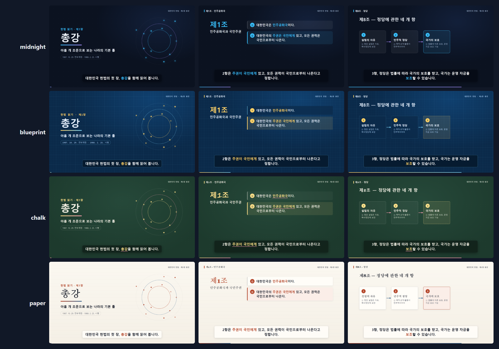

# explainer-studio

**문서나 git 저장소를 넣으면 낭독과 자막이 붙은 설명 영상이 나옵니다. 한국어·영어·일본어·중국어·스페인어를 지원합니다.**

Claude Code 스킬이자 일반 명령줄 도구입니다. 자료를 읽고, 사용자와 편 구성을 정하고, 대본을 쓰고, 음성을 합성하고, 장면을 움직여 MP4 와 SRT 로 만듭니다.

[English README](README.md)

## 예시

**대한민국 헌법 제1장 총강** — 대본 하나, 5개 언어:

| | 영상 | 자막 |
|---|---|---|
| 한국어 | [kr-constitution-ch1.ko.mp4](examples/kr-constitution-ch1/out/kr-constitution-ch1.ko.mp4) | [.srt](examples/kr-constitution-ch1/out/kr-constitution-ch1.ko.srt) |
| English | [kr-constitution-ch1.en.mp4](examples/kr-constitution-ch1/out/kr-constitution-ch1.en.mp4) | [.srt](examples/kr-constitution-ch1/out/kr-constitution-ch1.en.srt) |
| 日本語 | [kr-constitution-ch1.ja.mp4](examples/kr-constitution-ch1/out/kr-constitution-ch1.ja.mp4) | [.srt](examples/kr-constitution-ch1/out/kr-constitution-ch1.ja.srt) |
| 中文 | [kr-constitution-ch1.zh.mp4](examples/kr-constitution-ch1/out/kr-constitution-ch1.zh.mp4) | [.srt](examples/kr-constitution-ch1/out/kr-constitution-ch1.zh.srt) |
| Español | [kr-constitution-ch1.es.mp4](examples/kr-constitution-ch1/out/kr-constitution-ch1.es.mp4) | [.srt](examples/kr-constitution-ch1/out/kr-constitution-ch1.es.srt) |

대본 원본은 [examples/kr-constitution-ch1](examples/kr-constitution-ch1) 에 있습니다. 형식을 익히기에 좋습니다.

## 동작 방식

- **대본은 마크다운입니다.** 장마다 `screen` 블록(화면에 보일 것, YAML)과 낭독 줄(말할 것)이 있습니다. 번역할 때 코드는 건드리지 않습니다.
- **음성이 화면 시각을 정합니다.** 줄마다 음성을 먼저 만들어 길이를 재고, 화면 요소는 그 내용을 말하는 줄에 맞춰 나타납니다. 어느 언어에서도 마찬가지입니다.
- **렌더 결과가 늘 같습니다.** 장면은 시각 t 의 순수 함수라, 헤드리스 브라우저에서 한 프레임씩 넘기며 찍어 ffmpeg 로 묶습니다. 느린 PC 에서도 프레임이 빠지지 않고 시간만 더 걸립니다.

## 설치

Python 3.10 이상, 렌더용 Chromium 계열 브라우저, 기본 음성용 인터넷 연결이 필요합니다.

```bash
git clone https://github.com/lani319/explainer-studio.git
cd explainer-studio
python -m venv .venv && . .venv/bin/activate      # Windows: .venv\Scripts\activate
pip install -r requirements.txt
playwright install chromium                         # Chrome 이 설치돼 있으면 생략 가능
python skills/explainer/scripts/cli.py doctor --online
```

중국어·일본어는 CJK 글꼴이 필요합니다(Windows·macOS 는 기본 포함, Linux 는 `fonts-noto-cjk` 설치).

### Claude Code 에서 쓰기

플러그인으로 설치:

```text
/plugin marketplace add lani319/explainer-studio
/plugin install explainer-studio@explainer-studio
```

또는 `skills/explainer` 폴더를 `~/.claude/skills/` 에 복사합니다. 그다음 이렇게 요청하면 됩니다.

> ./docs 의 문서로 신입 팀원용 3분짜리 설명 영상을 한국어와 영어로 만들어 줘.

Claude 가 환경을 점검하고, 자료 목록을 만들고, 편 구성을 제안해 승인을 받은 뒤, 대본 작성 → 빌드 → 정지 화면 검수 → 렌더까지 진행합니다.

### Codex 에서 쓰기

이 스킬은 지시문과 파이썬 명령줄 도구로 되어 있어서, Codex 처럼 파일을 읽고 명령을 실행할 수 있는 에이전트라면 따라 할 수 있습니다. 이 저장소를 받아 둔 뒤, 프로젝트의 `AGENTS.md` 에 몇 줄을 넣습니다.

```markdown
## 설명 영상
설명·튜토리얼·교육 영상을 만들어 달라는 요청이 오면
`/path/to/explainer-studio/skills/explainer/SKILL.md` 를 읽고 그 순서대로 진행한다.
그 파일의 `<skill>` 은 `/path/to/explainer-studio/skills/explainer` 를 뜻한다.
```

그다음 Claude 에게 하듯 Codex 에 요청하면 됩니다. 쓰는 Codex 버전이 스킬 폴더를 읽는다면 `skills/explainer` 를 그 폴더에 복사해도 됩니다(버전별 문서 확인).

### 직접 쓰기

```bash
S=skills/explainer/scripts/cli.py
python $S ingest https://github.com/you/your-repo.git --workspace explainer
python $S new explainer/intro --lang ko --title "이 프로젝트가 하는 일"
# explainer/intro/script.ko.md 편집
python $S build explainer/intro              # 음성·시각표·재생 페이지·.srt (build/ko/index.html 로 미리보기)
python $S stills explainer/intro --lang ko cover:3 overview:5
python $S render explainer/intro             # → explainer/intro/out/intro.ko.mp4
```

`--tts none` 은 인터넷 없이 시간을 추정한 무음 초안을 만듭니다. `--voice male` 은 남성 음성으로 바꿉니다.

## 디자인 템플릿

배치는 같고 모양만 다른 4종 중에서 편마다 고릅니다. 어떤 대본이든 모든 템플릿에서 깨지지 않습니다.



| 템플릿 | 모양 | 어울리는 곳 |
|---|---|---|
| `midnight` (기본) | 짙은 남색, 하늘색·보라 강조 | 일반 설명 |
| `paper` | 따뜻한 종이색, 세리프 제목, 먹색·적갈색 | 문서·규정·보고 |
| `blueprint` | 파란 격자 도면, 호박색 강조, 고정폭 라벨 | 기술·코드·구조 설명 |
| `chalk` | 초록 칠판, 점선 테두리, 물결 밑줄 | 강의·교육 |

대본 머리말에서 고르거나, 빌드할 때 바꿔 볼 수 있습니다.

```yaml
---
id: intro
lang: ko
template: paper
theme: {accent: "#e4572e"}   # 선택: 템플릿 위에 브랜드 색 덮어쓰기
---
```

```bash
python $S templates                                   # 템플릿 목록
python $S build explainer/intro --template blueprint  # 대본을 고치지 않고 다른 모양으로
python $S templates explainer/intro --lang ko         # 내 편을 템플릿별로 나란히 본 미리보기
```

### 내 디자인 쓰기

브랜드 가이드, 샘플 슬라이드, 로고, 색상 코드, 글꼴 파일을 주면 Claude 가 읽고 나만의 템플릿으로 만든 뒤 내장 템플릿과 나란히 보여 줍니다.

```yaml
template: ../brand/brand.css        # 내 템플릿: 내장 템플릿을 복사해 값만 바꾼 것
theme:
  accent: "#0f766e"                 # 값 하나씩 덮어쓰기
  logo: ../brand/logo.svg           # 모든 장면 우상단과 표지에 표시
  fonts:
    - {family: Brand Sans, file: ../brand/BrandSans-Bold.woff2, weight: 800}
```

색 때문에 글자가 잘 안 읽히면 빌드가 경고합니다(`low contrast 2.6:1 (needs 4.5:1) — subtitles`). 브랜드 색이 가독성을 조용히 망치지 않게 하려는 것입니다. 자세한 내용은 [templates.md](skills/explainer/references/templates.md#your-own-design).

Claude 와 편 구성을 정할 때 이 미리보기를 보여 주고 템플릿을 묻습니다. 템플릿은 [`skills/explainer/engine/themes/`](skills/explainer/engine/themes) 의 CSS 파일 하나(디자인 토큰 모음)라, 하나를 복사해 나만의 템플릿을 만들 수 있습니다([방법](skills/explainer/references/templates.md)).

## 참고

- **음성**: 기본 엔진은 [edge-tts](https://github.com/rany2/edge-tts) 로 Microsoft Edge 온라인 음성을 씁니다. 인터넷이 필요하고, 상업적으로 쓰기 전에는 서비스 약관을 확인하세요. 음성 엔진은 교체할 수 있습니다(`scripts/explainer_lib/tts.py`).
- **자료**: 사용·공유가 허락된 자료로만 영상을 만드세요. 영상의 마지막 장면에 출처가 표시됩니다.
- **현황**: 0.1 — 글 기반 설명 장면. 예정: 실행 중인 웹 앱의 화면 캡처 투어.

## 라이선스

코드는 [MIT](LICENSE) 입니다. 예시 대본이 인용한 헌법 조문은 저작권 보호 대상이 아니며, `examples/` 의 번역과 영상도 같은 라이선스로 공개합니다.
