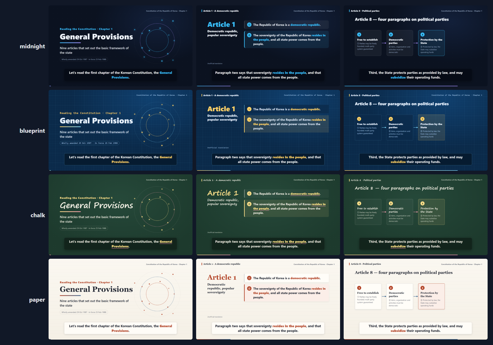

# explainer-studio

**Turn your documents or a git repository into narrated explainer videos — in Korean, English, Japanese, Chinese or Spanish.**

A Claude Code skill (and a plain command-line tool) that reads your material, plans short episodes with you, writes the scripts, synthesizes a narrator, animates the scenes and renders MP4 + SRT.

[한국어 README](README.ko.md)

## Example

*The Constitution of the Republic of Korea, Chapter 1 (General Provisions)* — one script, five languages:

| | video | subtitles |
|---|---|---|
| 한국어 | [kr-constitution-ch1.ko.mp4](examples/kr-constitution-ch1/out/kr-constitution-ch1.ko.mp4) | [.srt](examples/kr-constitution-ch1/out/kr-constitution-ch1.ko.srt) |
| English | [kr-constitution-ch1.en.mp4](examples/kr-constitution-ch1/out/kr-constitution-ch1.en.mp4) | [.srt](examples/kr-constitution-ch1/out/kr-constitution-ch1.en.srt) |
| 日本語 | [kr-constitution-ch1.ja.mp4](examples/kr-constitution-ch1/out/kr-constitution-ch1.ja.mp4) | [.srt](examples/kr-constitution-ch1/out/kr-constitution-ch1.ja.srt) |
| 中文 | [kr-constitution-ch1.zh.mp4](examples/kr-constitution-ch1/out/kr-constitution-ch1.zh.mp4) | [.srt](examples/kr-constitution-ch1/out/kr-constitution-ch1.zh.srt) |
| Español | [kr-constitution-ch1.es.mp4](examples/kr-constitution-ch1/out/kr-constitution-ch1.es.mp4) | [.srt](examples/kr-constitution-ch1/out/kr-constitution-ch1.es.srt) |

The scripts behind them are in [examples/kr-constitution-ch1](examples/kr-constitution-ch1) — a good place to see the format.

## How it works

```text
your docs / repo ──ingest──▶ inventory ──(you + Claude)──▶ plan ──▶ script.<lang>.md
                                                                       │
            MP4 + SRT ◀──render── page (1920×1080 stage) ◀──build──────┘
                                   ▲            ▲
                         scene types (engine)  speech per line (timed first)
```

- **Scripts are Markdown.** Each section has a `screen` block (what is shown, as YAML) and narration lines (what is said). Translating a script never touches code.
- **Speech times the picture.** Every line is synthesized and measured first; items on screen appear on the line that talks about them — in every language.
- **Deterministic rendering.** Scenes are pure functions of time; the renderer steps through frames in a headless browser and pipes them to ffmpeg. A slow machine takes longer but never drops frames.

## Install

Requirements: Python 3.10+, a Chromium-based browser for rendering, internet access for the default voices.

```bash
git clone https://github.com/lani319/explainer-studio.git
cd explainer-studio
python -m venv .venv && . .venv/bin/activate      # Windows: .venv\Scripts\activate
pip install -r requirements.txt
playwright install chromium                         # or skip if Google Chrome is installed
python skills/explainer/scripts/cli.py doctor --online
```

Chinese and Japanese need a CJK font (Windows and macOS ship one; on Linux install `fonts-noto-cjk`).

### Use it from Claude Code

As a plugin:

```text
/plugin marketplace add lani319/explainer-studio
/plugin install explainer-studio@explainer-studio
```

Or copy `skills/explainer` into `~/.claude/skills/`. Then ask, for example:

> Make a 3-minute explainer video in English and Japanese from the docs in ./docs for new team members.

Claude checks your setup, inventories the material, proposes episodes and waits for your approval, then writes, builds, reviews stills and renders.

### Use it from Codex

The skill is plain instructions plus a Python CLI, so Codex (or any coding agent that can read files and run commands) can follow it. Clone this repository somewhere, then add a few lines to your project's `AGENTS.md`:

```markdown
## Explainer videos
When asked to make an explainer, tutorial or training video, read
`/path/to/explainer-studio/skills/explainer/SKILL.md` and follow its workflow.
In that file, `<skill>` means `/path/to/explainer-studio/skills/explainer`.
```

Then ask Codex as you would ask Claude. If your Codex version loads skills from a skills folder, you can copy `skills/explainer` there instead — check your version's documentation.

### Use it by hand

```bash
S=skills/explainer/scripts/cli.py
python $S ingest https://github.com/you/your-repo.git --workspace explainer
python $S new explainer/intro --lang en --title "What this project does"
# edit explainer/intro/script.en.md
python $S build explainer/intro              # speech, timeline, page, .srt  (open build/en/index.html to preview)
python $S stills explainer/intro --lang en cover:3 overview:5
python $S render explainer/intro             # → explainer/intro/out/intro.en.mp4
```

`--tts none` builds a silent draft with estimated timing (no internet needed). `--voice male` switches voices.

## Languages

| code | default voice (female / male) | subtitles wrap by |
|---|---|---|
| `ko` | ko-KR-SunHiNeural / InJoonNeural | words (keep-all) |
| `en` | en-US-JennyNeural / GuyNeural | words |
| `ja` | ja-JP-NanamiNeural / KeitaNeural | characters, with line-start rules |
| `zh` | zh-CN-XiaoxiaoNeural / YunxiNeural | characters |
| `es` | es-ES-ElviraNeural / AlvaroNeural | words |

Per-language settings are plain YAML in [`skills/explainer/lang/`](skills/explainer/lang). Adding a language is one file.

## Design templates

Four looks, same layouts — pick one per episode. Every script works with every template.



| template | look | good for |
|---|---|---|
| `midnight` (default) | deep navy, sky-blue and violet accents | general explainers |
| `paper` | warm off-white page, serif headings, ink and terracotta | documents, policies, reports |
| `blueprint` | blue grid sheet, amber highlights, monospace labels | technical walkthroughs, code, architecture |
| `chalk` | green chalkboard, dashed outlines, wavy underlines | lessons and training |

Choose it in the script's front matter, or override it when building:

```yaml
---
id: intro
lang: en
template: paper
theme: {accent: "#e4572e"}   # optional: your brand colors on top of the template
---
```

```bash
python $S templates                                   # list templates
python $S build explainer/intro --template blueprint  # try another look without editing the script
python $S templates explainer/intro --lang en         # gallery of your episode in every template
```

When Claude plans an episode with you, it shows the gallery and asks which template to use. A template is one CSS file of design tokens in [`skills/explainer/engine/themes/`](skills/explainer/engine/themes) — copy one to make your own ([how](skills/explainer/references/templates.md)).

## Documentation

- [Skill instructions](skills/explainer/SKILL.md) — the workflow Claude follows
- [Script format](skills/explainer/references/script-format.md)
- [Scene types](skills/explainer/references/scene-types.md) — `cover`, `cards`, `quote`, `flow`, `list`, `closing`, and custom types
- [Languages](skills/explainer/references/languages.md)
- [Design templates](skills/explainer/references/templates.md)
- [Review checklist](skills/explainer/references/review.md)

## Notes

- **Voices.** The default engine uses Microsoft Edge's online neural voices through [edge-tts](https://github.com/rany2/edge-tts). It needs internet access, and you should check the service terms before commercial use. The engine is pluggable (`scripts/explainer_lib/tts.py`).
- **Your material.** Only make videos from material you are allowed to use and share. Videos cite their sources on the closing scene.
- **Status.** 0.1 — explainer scenes from text. Planned: screen-capture tours of a running web app.

## License

[MIT](LICENSE) for the code. The example scripts quote a public-domain text; the translations and videos in `examples/` are released under the same license.
